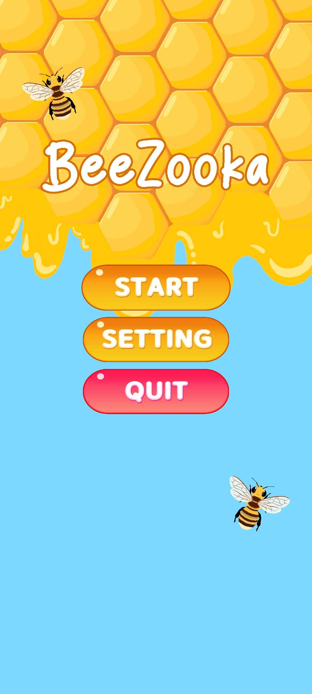
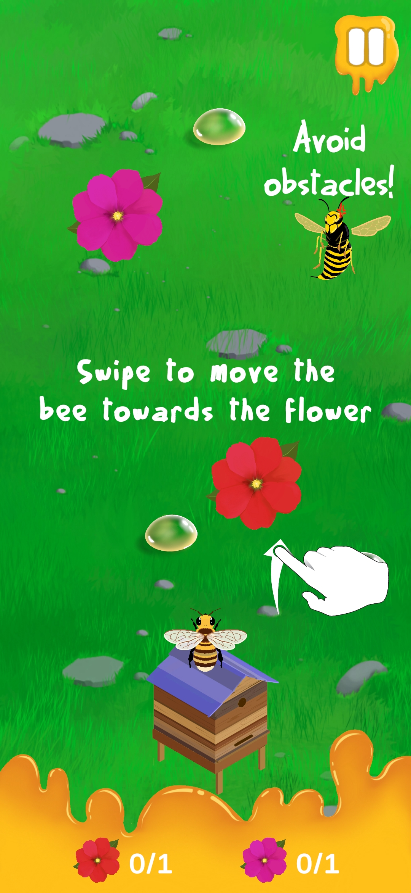
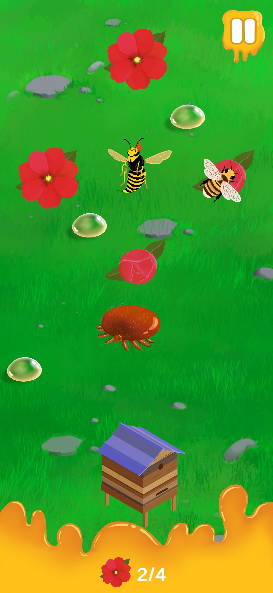

# 🐝 BeeZooka 🐝

BeeZooka is a mobile game where players take control over a bee. The goal is to pollinate flowers and return to the beehive. Watch out for deadly obstacles!

### How to play 🎮

To control the bee, simply swipe your finger in the direction you want to fly.
Every level contains flowers that need to be pollinated in order to progress. Flowers that have not been pollinated provide a safe spot and allow to think through the next move.
Some levels are pretty challenging and require you to bounce off screen edges to get to the target. Once all flowers have been pollinated, return to the beehive to complete the level.
Make sure to pollinate flowers in correct order - you don't want to make your way back to beehive too difficult, right?

### Level structure 🗺️

Levels consist of:
- flowers
- obstacles
- nectar drops
- beehive
- sticky honey

Flowers are your main goal - either get to them directly or bounce off screen. Avoid obstacles - bees really don't like hornets. Return to beehive after you have pollinated required flowers.
Make sure not to land on sticky honey at the bottom of the screen. You can also collect nectar drops along the way to max out the level and become true master of bees!

### Screenshots 📸

